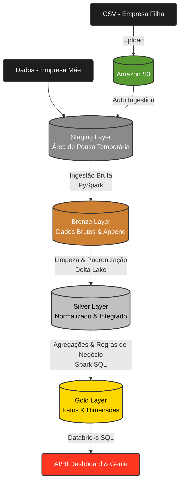

# FMCG-End-to-End-Data-Engineering-Project-using-Databricks

<div align="center">

  <br>

  [](https://databricks.com)
  [](https://spark.apache.org/)
  [](https://delta.io/)
  [](https://aws.amazon.com/s3/)
  [](https://python.org)
  [](https://opensource.org/licenses/MIT)

  <p align="center">
    <i>Pipeline de Engenharia de Dados moderno, escalável e totalmente automatizado, construído no Databricks para processar dados de uma empresa do setor FMCG (bens de consumo de giro rápido), utilizando a Arquitetura Lakehouse (Medallion).</i>
  </p>

</div>

---

## Sobre o Projeto

Este repositório documenta a construção de um **pipeline de Engenharia de Dados End-to-End**, desenvolvido inteiramente no **Databricks** e **AWS S3**, aplicando a **Arquitetura Medallion** (Bronze → Silver → Gold) com uma camada adicional de **Staging** entre a ingestão bruta e a limpeza dos dados.

O objetivo foi simular um cenário real de negócio — a aquisição de uma empresa menor por uma grande companhia de FMCG — consolidando dados de origens distintas em uma plataforma analítica única, governada pelo **Unity Catalog**, com transações **ACID** via **Delta Lake** e visualização final em **Databricks AI/BI Dashboards**.

---

## Problema de Negócio

Uma **empresa-mãe (parent)** do setor FMCG realiza a aquisição de uma **empresa menor (child)**. Como as duas companhias mantêm sistemas de dados separados, o objetivo do projeto é consolidar as informações em uma arquitetura Lakehouse unificada para análise e geração de relatórios.

- Os dados da **empresa-mãe** já residem dentro do Databricks.
- Os dados brutos da **empresa filha** chegam em arquivos **CSV**.
- Esses arquivos são disponibilizados em um **bucket do Amazon S3**, que atua como fonte externa de dados.
- O Databricks realiza a extração dos arquivos do S3 e os ingere na Lakehouse.
- Os dados passam por **staging, limpeza, transformação, validação e integração** com os dados da empresa-mãe, formando uma base analítica unificada.

O resultado final permite que usuários de negócio analisem vendas, clientes, produtos e lojas de forma consolidada através de dashboards interativos.

---

## Stack Tecnológica

| Categoria | Tecnologia | Finalidade |
| :--- | :--- | :--- |
| **Plataforma** |  | Ambiente unificado de dados e processamento distribuído |
| **Processamento** |   | Transformações e lógica de negócio |
| **Armazenamento** |  | Armazenamento transacional (ACID) da Lakehouse |
| **Fonte Externa** |  | Armazenamento e ingestão dos dados da empresa filha |
| **Governança** | **Unity Catalog** | Catalogação, segurança e linhagem centralizada dos dados |
| **Orquestração** | **Databricks Workflows** | Automação e agendamento das tarefas do pipeline |
| **BI & Analytics** | **Databricks AI/BI Dashboard** | Visualização interativa dos dados da camada Gold |
| **NL Analytics** | **Genie** | Consultas em linguagem natural sobre os dados de negócio |
| **Versionamento** |   | Controle de versão e portfólio |

---

## Arquitetura



### Camada de Staging

Diferente do modelo clássico "Bronze → Silver → Gold", este projeto adiciona uma **camada de Staging** logo após a ingestão do S3, funcionando como uma **área de pouso (landing zone) temporária e volátil**, antes da persistência definitiva na camada Bronze. Essa camada:

- Isola o processo de ingestão de eventuais falhas ou reprocessamentos, evitando impacto direto na Bronze.
- Permite validações estruturais rápidas (schema, tipos, arquivos corrompidos) antes da persistência histórica.
- Facilita a reexecução de cargas (full load) sem duplicar dados na camada Bronze.
- Serve como buffer entre a origem externa (S3 / empresa filha) e o restante do pipeline Lakehouse.

---

## Estrutura do Repositório

```text
fmcg-data-engineering-databricks
 ├── consolidated_pipeline
 ├── dashboarding
 ├── orquestration
 ├── resources
 ├── 0_data.rar
 ├── LICENSE
 └── README.md
```

---

## Fluxo do Pipeline (Medallion + Staging)

### Staging Layer (Área de Pouso)
- **Objetivo:** Receber os arquivos brutos vindos do Amazon S3 antes de qualquer persistência definitiva.
- **Processo:** Leitura dos arquivos CSV originais, checagem estrutural básica (schema esperado, arquivos vazios/corrompidos) e organização temporária dos dados para a próxima etapa de ingestão.

### Bronze Layer (Raw)
- **Objetivo:** Persistir os dados brutos vindos da Staging em tabelas Delta, sem transformações de negócio.
- **Processo:** Grava os dados como estão, adiciona metadados de ingestão (timestamp, nome do arquivo de origem, processo de carga) e mantém histórico completo.

### Silver Layer (Cleansed)
- **Objetivo:** Filtrar, limpar e conformar os dados.
- **Processo:** Tratamento de nulos, remoção de duplicidades, padronização de schema, validação de regras de negócio e integração dos dados da empresa mãe com os da empresa filha.

### Gold Layer (Business-Ready)
- **Objetivo:** Disponibilizar dados prontos para consumo por ferramentas de BI e modelos de ML.
- **Processo:** Criação de tabelas **Fato** e **Dimensão** (Star Schema) e agregações de negócio (ex.: vendas mensais por categoria, desempenho por região/loja).

---

## Cargas: Histórica e Incremental

- **Carga Histórica (Full Load):** processo inicial que carrega todo o histórico de dados transacionais nas tabelas Delta.
- **Carga Incremental:** implementada com operações **MERGE** do Delta Lake, processando apenas os registros novos/alterados, evitando duplicidade e aumentando a eficiência do processamento.

---

## Orquestração (Databricks Workflows)

O pipeline completo é automatizado via **Databricks Workflows**, com dependências entre as etapas:

`Staging → Bronze → Silver (Histórico) → Silver (Incremental) → Gold`

---

## Genie — Consultas em Linguagem Natural

Configurado o **Databricks Genie** sobre a camada Gold, permitindo que usuários de negócio façam perguntas em linguagem natural, por exemplo:

> "Mostre o total de vendas por região."
> "Qual divisão teve o maior crescimento no último ano?"

---

## Aprendizados

- Design e implementação da **Arquitetura Lakehouse** (com camada extra de Staging).
- Integração do Databricks com **Amazon S3** como fonte externa.
- Escrita de transformações otimizadas em **PySpark**.
- Orquestração de pipelines com **Databricks Workflows**.
- Técnicas de otimização do **Delta Lake** (`OPTIMIZE`, `ZORDER`, `MERGE`).
- Governança de dados com **Unity Catalog**.
- Construção de **dashboards de negócio** e uso do **Genie** para analytics conversacional.
- Documentação técnica de projeto para portfólio.

---

Projeto implementado como exercício prático de aprendizado, inspirado no projeto **"End to End Data Engineering Project using Databricks Free Edition | FMCG Domain"** do canal no youtube [**codebasics**](https://www.youtube.com/@codebasics). Implementação, organização do código, repositório GitHub, camada de Staging adicional e documentação foram desenvolvidos de forma independente para fins de aprendizado e portfólio.

